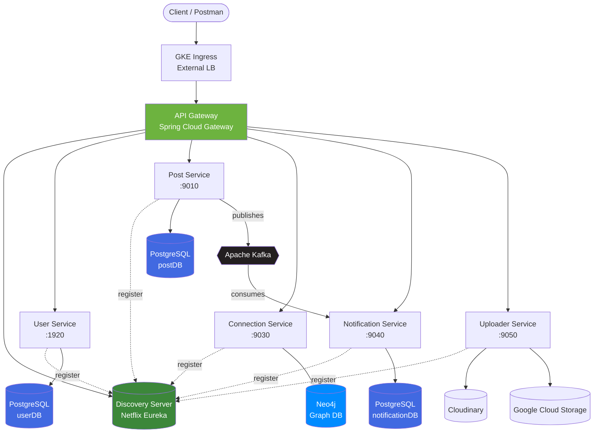

<div align="center">

# 🚀 Elevate

### A Distributed Microservices LinkedIn Clone

*Not just another LinkedIn clone — a production-style, cloud-deployed microservices platform built to demonstrate real-world backend engineering.*

[](https://openjdk.org/)
[](https://spring.io/projects/spring-boot)
[](https://cloud.google.com/kubernetes-engine)
[](https://www.docker.com/)
[](https://kafka.apache.org/)
[](https://www.postgresql.org/)
[](https://neo4j.com/)


<!-- 🎬 Replace this with an actual demo GIF of the app in action -->


</div>

---

## 📖 Table of Contents

- [Overview](#-overview)
- [Architecture](#-architecture)
- [Tech Stack](#-tech-stack)
- [Services](#-services)
- [Screenshots](#-screenshots)
- [Getting Started](#-getting-started)
- [Deployment](#-deployment)
- [API Reference](#-api-reference)
- [Roadmap](#-roadmap)
- [Author](#-author)

---

## 🌟 Overview

**Elevate** is a distributed, event-driven microservices platform inspired by LinkedIn — built from the ground up to explore real backend engineering challenges: service discovery, polyglot persistence, async messaging, container orchestration, and cloud deployment.

Instead of a monolith, every core capability lives in its own independently deployable Spring Boot service, all wired together through **Eureka**, routed via an **API Gateway**, and deployed on **Google Kubernetes Engine (GKE)**.

> 💡 Built to showcase distributed systems design, not just CRUD — service discovery, event-driven notifications, polyglot databases, and container orchestration are first-class citizens here.

---

## 🏗️ Architecture



---

## 🧰 Tech Stack

| Layer | Technology |
|---|---|
| **Language** | Java 21 |
| **Framework** | Spring Boot 4.1.0, Spring Cloud 2025.1.2 |
| **Service Discovery** | Netflix Eureka |
| **API Gateway** | Spring Cloud Gateway (WebFlux) |
| **Messaging** | Apache Kafka |
| **Relational DB** | PostgreSQL |
| **Graph DB** | Neo4j (social connections) |
| **Auth** | JWT (JJWT) |
| **File Storage** | Cloudinary, Google Cloud Storage |
| **Containerization** | Docker, Jib (Maven) |
| **Orchestration** | Kubernetes (Google Kubernetes Engine) |
| **API Testing** | Postman |

---

## 🧩 Services

| Service | Responsibility | Port | Database |
|---|---|:---:|---|
| 🌐 **API Gateway** | Single entry point, routing, load balancing | `8080` | – |
| 🔎 **Discovery Server** | Service registry (Eureka) | `8761` | – |
| 👤 **User Service** | Auth (JWT), signup/login, profiles | `1920` | PostgreSQL |
| 📝 **Post Service** | Create/like/comment on posts | `9010` | PostgreSQL |
| 🤝 **Connection Service** | Social graph — connections, first-degree network | `9030` | Neo4j |
| 🔔 **Notification Service** | Kafka-consumer, real-time notifications | `9040` | PostgreSQL |
| 📁 **Uploader Service** | Media upload (images) via Cloudinary/GCS | `9050` | – |

---
## ⚡ Getting Started

### Prerequisites
- Java 21
- Maven
- Docker
- A running Kafka cluster (or use `k8s/kafka.yml`)
- PostgreSQL & Neo4j instances

### Run locally

```bash
# Clone the repo
git clone https://github.com/Bhavnish15/Elevate.git
cd Elevate

# Start each service (repeat per service directory)
cd userService
./mvnw spring-boot:run
```

Each service reads its local config from `application.properties`, pointing to `localhost` for databases and Eureka.

---

## ☁️ Deployment

Elevate is fully containerized and deployed on **Google Kubernetes Engine**:

```bash
# Build & push images (via Jib)
./mvnw clean package

# Apply Kubernetes manifests
kubectl apply -f k8s/
```

Each service ships with:
- A dedicated `Deployment` + `Service`
- Resource-tuned CPU/memory limits
- `application-k8s.properties` profile for cluster-specific config (service DNS names, env-injected secrets)
- Secrets management via Kubernetes `Secret` objects (never hardcoded)

An **Ingress** exposes the API Gateway externally, fronting the entire platform behind a single load balancer.

<sub>🎬 *Add a terminal recording GIF of `kubectl apply -f k8s/` → `kubectl get pods` going green*</sub>

---

## 📡 API Reference

| Method | Endpoint | Description |
|---|---|---|
| `POST` | `/api/v1/users/auth/signup` | Register a new user |
| `POST` | `/api/v1/users/auth/login` | Authenticate & receive JWT |
| `POST` | `/posts` | Create a new post |
| `POST` | `/posts/{id}/like` | Like a post |
| `GET` | `/connections/first-degree` | Get first-degree connections |
| `POST` | `/uploads` | Upload media (image) |

<sub>Full collection available via the project's Postman workspace.</sub>

---

## 🗺️ Roadmap

- [ ] Comments on posts
- [ ] WebSocket-based real-time notifications
- [ ] Search service (Elasticsearch)
- [ ] CI/CD pipeline (GitHub Actions → GKE)
- [ ] Horizontal Pod Autoscaling

---

## 👤 Author

**Bhavnish Bhardwaj**

[](https://linkedin.com/in/bhavnishbharadwaj)
[](https://portfolio-bhavnish15.vercel.app)

<div align="center">
<sub>⭐️ If you found this project interesting, consider giving it a star!</sub>
</div>
